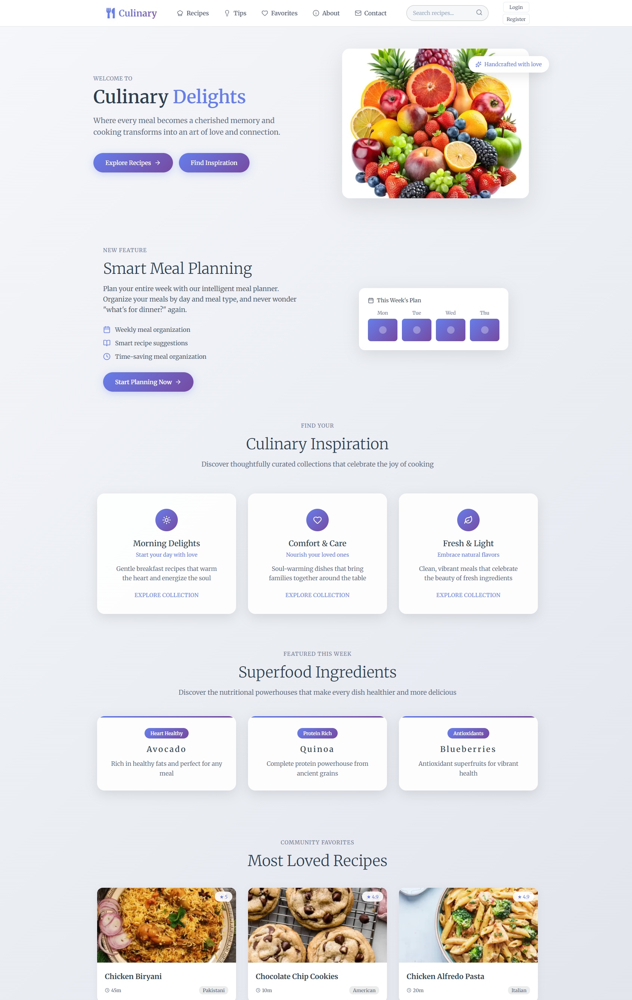
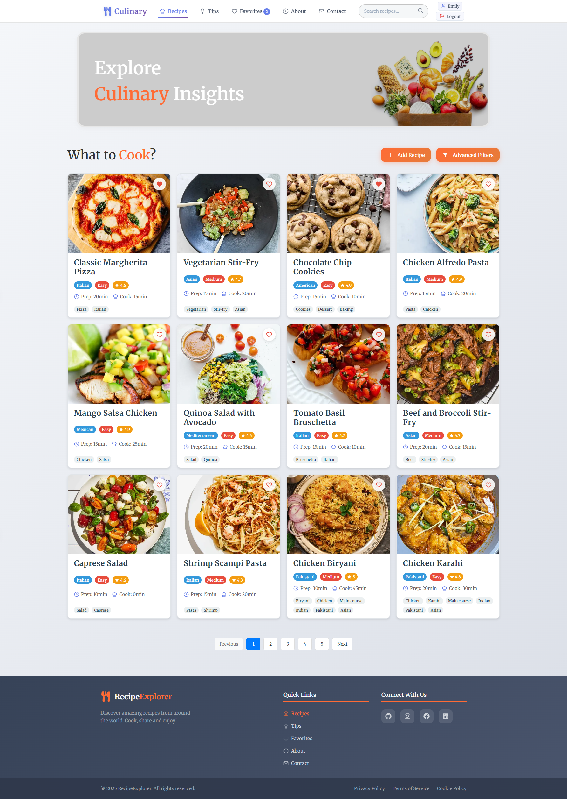
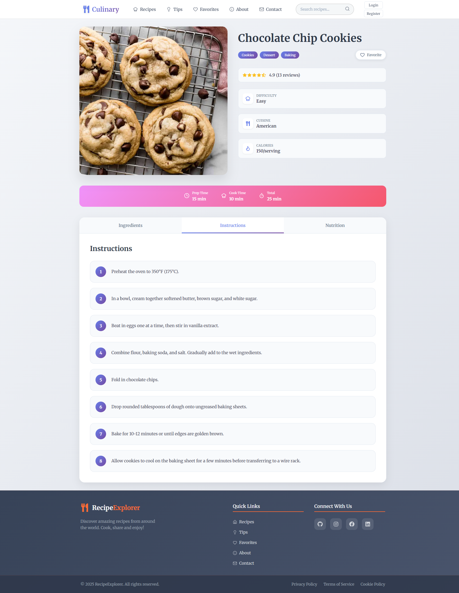
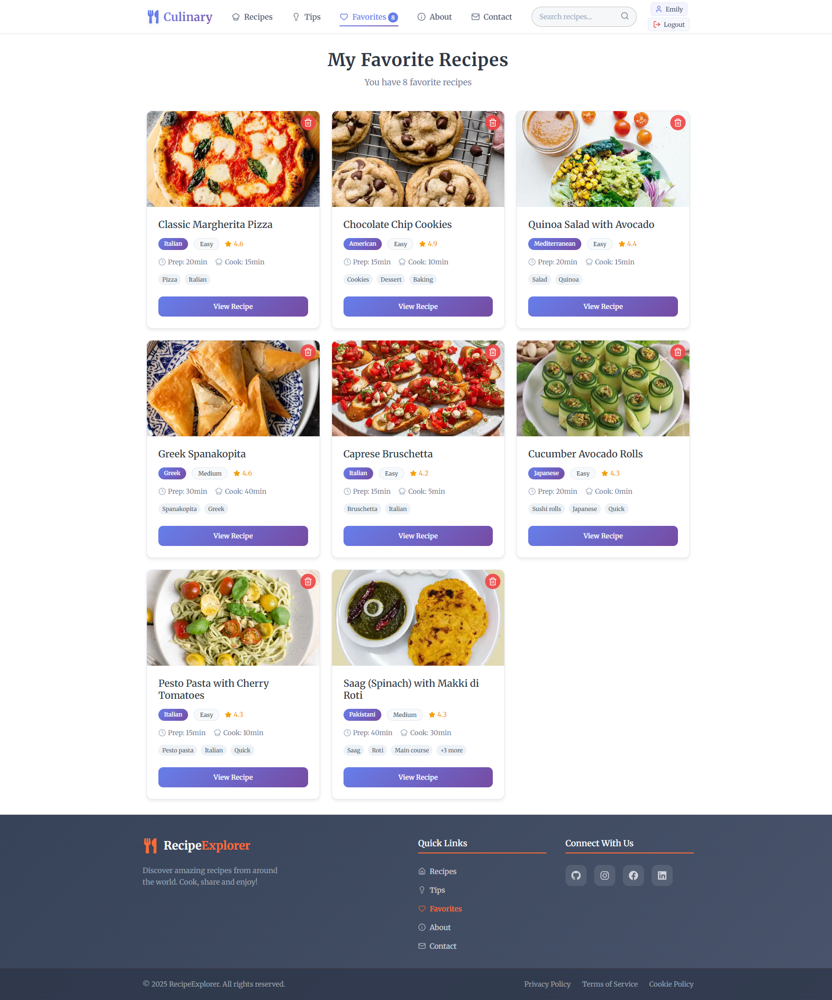
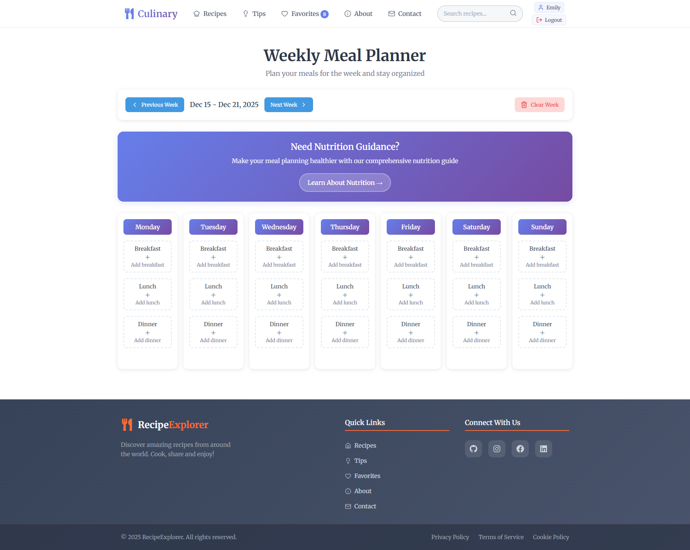
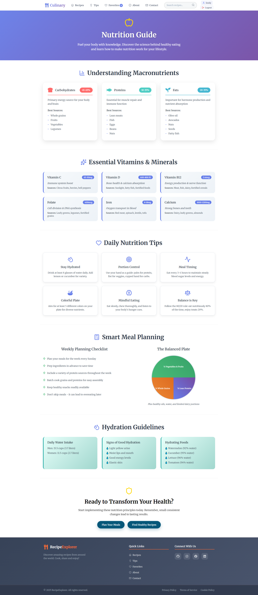
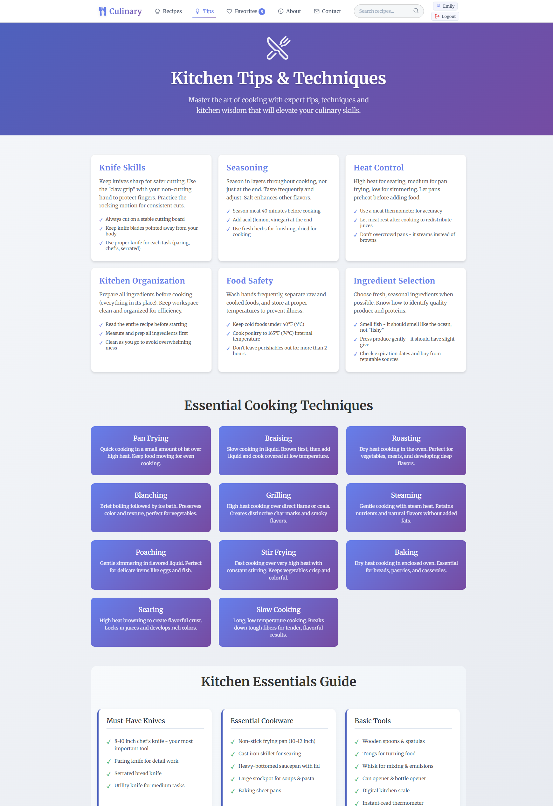
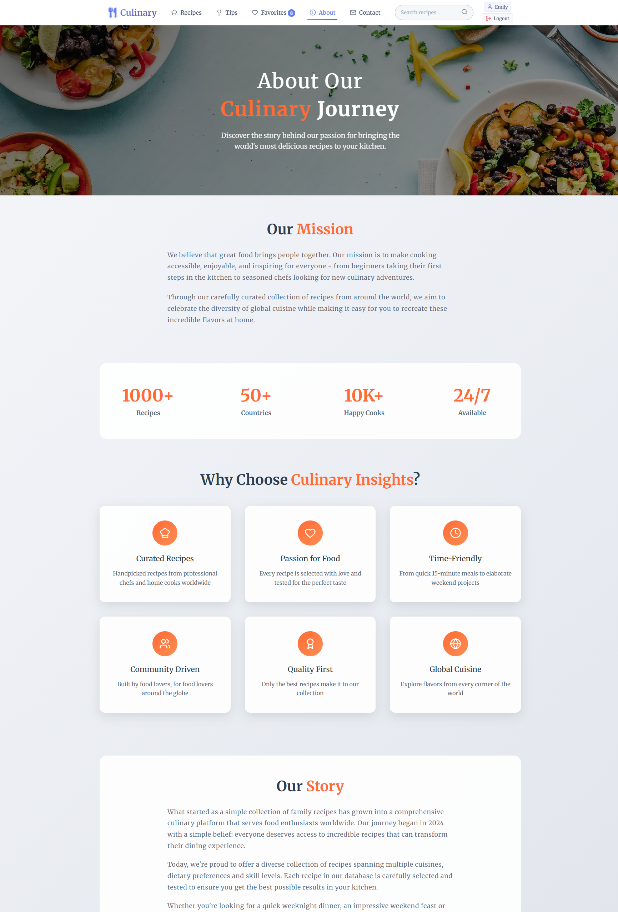
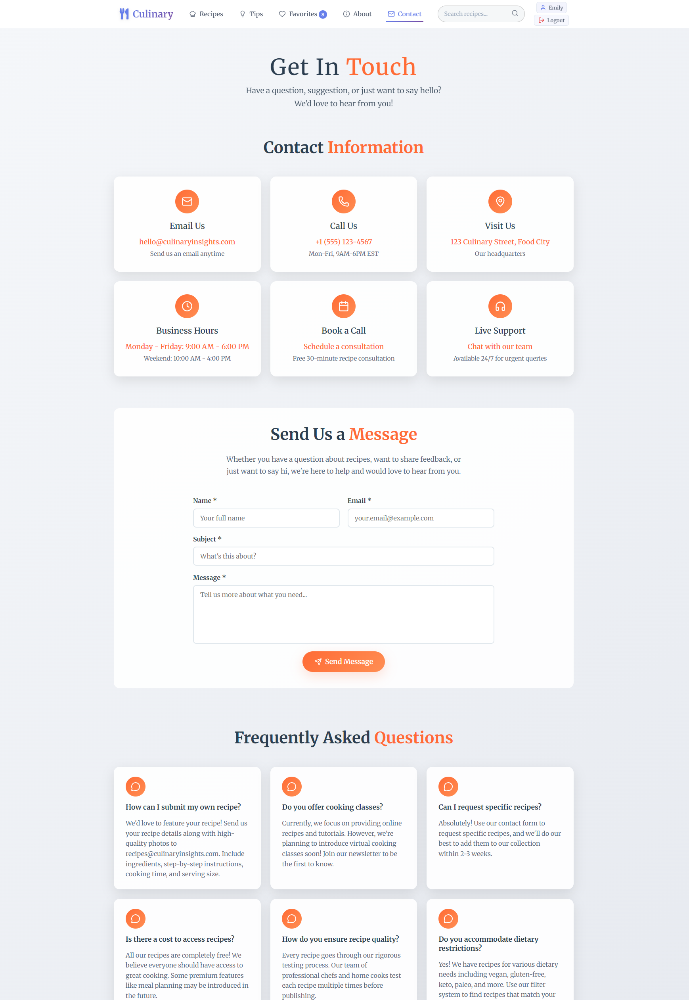

# 🍽️ Culinary Delights

<div align="center">
  <h3><em>Where Every Meal Becomes a Memory</em></h3>
  
  
  
  
  
</div>

## 🌟 Overview

**Culinary Delights** is a modern, feature-rich culinary platform built with Next.js and React. It's designed to be your ultimate cooking companion, offering recipe discovery, meal planning, nutrition tracking and much more.

## ✨ Key Features

### 🏠 **Home Dashboard** - `/`



- **Featured Recipes**: Discover trending and popular recipes
- **Quick Navigation**: Easy access to all platform features
- **Beautiful UI**: Modern, responsive design

### 🔐 **Authentication**

- **Login/Register**: User authentication system
- **Protected Routes**: Some pages require login to access

### 📚 **Recipe Collection** - `/recipes`



- **Recipe Database**: Browse recipes from DummyJSON API
- **Recipe Cards**: View recipes with images, titles, ratings and cooking times
- **Search Functionality**: Search recipes by name or ingredients
- **Advanced Filters**: Filter by cook time, difficulty, rating, meal type, and cuisine
- **Pagination**: Navigate through recipe pages
- **Add Recipe Modal**: Create and save your own custom recipes (requires login)
- **User Recipes**: View your created recipes alongside API recipes

#### **Recipe Details** - `/recipes/[id]`



- **Complete Recipe Info**: Ingredients list, step-by-step instructions and nutritional data
- **Recipe Details**: Prep time, cook time, servings, difficulty level and cuisine
- **Visual Layout**: Recipe image, rating system with stars
- **Add to Favorites**: Heart button to save recipes (requires login)
- **Recipe Tags**: Category tags for easy identification

### ❤️ **Favorites** - `/favorites` 🔒 _Protected Route_



- **Personal Recipe Collection**: View all your bookmarked recipes
- **Recipe Grid Layout**: Visual cards showing recipe images, names and details
- **Recipe Information**: Display cuisine, difficulty, rating, prep/cook times
- **Recipe Tags**: View recipe categories and tags
- **Quick Actions**: Remove recipes from favorites with trash button
- **Direct Navigation**: Click recipe cards to view full details
- **Empty State**: Helpful message with link to browse recipes when no favorites exist
- **Recipe Count**: Shows total number of favorite recipes
- **Redux State**: Favorites persist across browser sessions

### 📅 **Meal Planner** - `/meal-planner` 🔒 _Protected Route_



- **Weekly Calendar View**: Plan meals for breakfast, lunch, and dinner across 7 days
- **Week Navigation**: Navigate between different weeks with arrow buttons
- **Recipe Selection**: Add recipes from database to meal slots via modal popup
- **Recipe Information**: View recipe details like cook time, rating and difficulty
- **Meal Management**: Add and remove meals from specific time slots
- **Clear Week Option**: Remove all planned meals for the current week
- **Persistent Storage**: Meal plans are saved and loaded automatically
- **User-Specific Plans**: Each user has their own personalized meal plans
- **Visual Interface**: Clean grid layout showing days and meal types

### 🍎 **Nutrition Tracker** - `/nutrition`



- **Comprehensive Tracking**: Monitor daily and weekly nutritional intake
- **Nutritional Analysis**: Detailed breakdown of calories, macros and micronutrients
- **Visual Charts**: Interactive graphs showing your nutrition progress over time
- **Dietary Restrictions**: Support for various dietary preferences and allergies
- **Macronutrient Balance**: Track carbohydrates, proteins and fats intake
- **Vitamin & Mineral Tracking**: Monitor essential micronutrients

### 💡 **Cooking Tips** - `/tips`



- **Kitchen Skills**: Essential knife skills, proper cutting techniques and safety tips
- **Cooking Techniques**: Heat control, seasoning layers and cooking methods
- **Kitchen Organization**: Prep strategies and workspace efficiency
- **Professional Tips**: Chef secrets and culinary wisdom for better cooking
- **Food Safety**: Important guidelines for safe food handling and storage
- **Equipment Advice**: Proper use of kitchen tools and knife selection
- **Ingredient Knowledge**: Tips for selecting and working with different ingredients

### 📖 **About & Community** - `/about`



- **Platform Story**: Learn about the mission and vision of Culinary Delights
- **Team Information**: Meet the developers and culinary experts behind the platform
- **Technology Showcase**: Overview of the modern tech stack powering the site
- **Success Stories**: Inspiring cooking journeys from users and testimonials
- **Platform Statistics**: User count, recipes available and community growth

### 👤 **User Profile** - `/profile` 🔒 _Protected Route_

- **Profile Information**: View your personal account details
- **User Details**: Display first name, last name, username and email
- **Additional Info**: Shows age and phone number if available
- **Read-Only View**: Simple profile display of your account information
- **Authentication Required**: Must be logged in to access profile page

### 📞 **Contact** - `/contact`



- **Contact Form**: Get in touch with us using the contact form
- **Multiple Contact Methods**: Various ways to reach our support team
- **Business Inquiries**: Information for partnerships and collaborations

## �🔧 Technical Stack

### **Frontend**

- **Next.js 16.0.5** - React framework with App Router
- **React 19.2.0** - Latest React with concurrent features
- **TypeScript** - Type-safe development
- **CSS Modules** - Scoped styling for components

## 🚀 Getting Started

### **Prerequisites**

- Node.js (16.0 or later)
- npm or yarn package manager
- Modern web browser

### **Installation**

1. **Clone the repository**

   ```bash
   git clone <your-repository-url>
   cd culinary
   ```

2. **Install dependencies**

   ```bash
   npm install
   # or
   yarn install
   ```

3. **Start the development server**

   ```bash
   npm run dev
   # or
   yarn dev
   ```

4. **Open your browser**
   ```
   Navigate to http://localhost:3000
   ```

### **Available Scripts**

- `npm run dev` - Start development server
- `npm run build` - Create production build
- `npm run start` - Start production server
- `npm run lint` - Run ESLint for code quality

## 🎨 Features in Detail

### **User Authentication**

- Secure login and registration system
- Password validation with Yup
- Persistent login sessions
- Protected routes for authenticated users

### **Recipe Management**

- Browse thousands of recipes from external APIs
- Create and edit your own recipes
- Advanced search with multiple filters
- Recipe rating and review system

### **Responsive Design**

- Mobile-first approach
- Tablet and desktop optimization
- Touch-friendly interface
- Fast loading times

### **Performance Optimization**

- Next.js Image optimization
- Code splitting and lazy loading
- Efficient state management
- Browser caching strategies

## 🛠️ Development

### **Project Structure**

```
culinary/
├── src/
│   ├── app/                 # Next.js App Router pages
│   │   ├── (auth)/         # Authentication pages
│   │   ├── about/          # About page
│   │   ├── contact/        # Contact page
│   │   ├── favorites/      # Favorites page
│   │   ├── meal-planner/   # Meal planning
│   │   ├── nutrition/      # Nutrition tracking
│   │   ├── profile/        # User profile
│   │   ├── recipes/        # Recipe pages
│   │   └── tips/           # Cooking tips
│   ├── components/         # Reusable components
│   └── lib/               # State management & utilities
├── public/                # Static assets
└── Configuration files
```

### **Coding Standards**

- TypeScript for type safety
- ESLint for code quality
- CSS Modules for component styling
- Consistent naming conventions
- Component-based architecture

## 🌟 Acknowledgments

- **Recipe Data**: Powered by DummyJSON API
- **Icons**: Lucide React and Heroicons
- **Framework**: Built with Next.js and React

---

<div align="center">
  <p><strong>Made with ❤️ for food lovers everywhere</strong></p>
</div>
